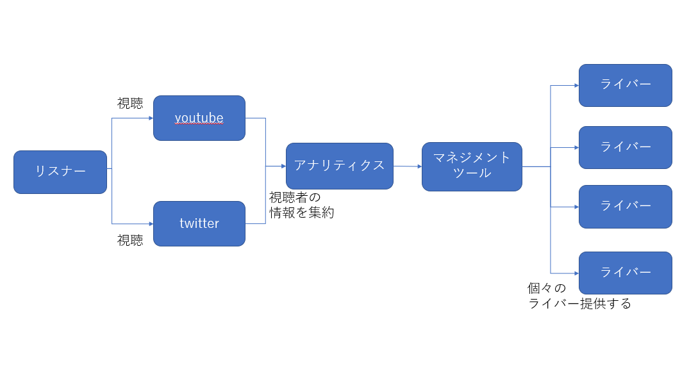

<!-- ---
marp: false

size: 16:9

--- -->

# 要件定義書

## システム化の目的、背景、狙い

* 目的
  * 宣伝やアナリティクス管理の強化を行い、会社のネームバリューを向上させる。

* 背景
  * 競合が多く所属タレントが伸び悩んでいる。
  * 登録者を増やすためにも、宣伝とアナリティクスの管理が必要である。
  * グッツ販売も検討しているが、必要なノウハウがない。

* 狙い
  * チャンネル登録及び広告収入の増加
  * Vtuber事務所の規模拡大

## ビジネスプロセス関係図

## 業務機能構成表

|  ビジネスプロセス  |           システム利用作業           |                      業務機能要件                      | 利用者 |           備考           |
| :----------------: | :----------------------------------: | :----------------------------------------------------: | :----: | :----------------------: |
| アナリティクス管理 |  専用ツールからアナリティクスを監視  | 各サイトから収集したアナリティクスを各ライバー毎に管理 |  社員  |        後から開発        |
|    マネジメント    | ライバー毎に分析された結果を表示する |            集計されたデータを元に分析を行う            |  社員  |        後から開発        |
|       HP管理       |          CMSを用いたHP管理           |              HPを管理するためのCMSを提供               |  社員  |                          |
|      人材採用      |     サイト内の募集ページから応募     |        応募者のデータを取りまとめて担当者へ送信        | 一般人 |                          |
|     グッズ販売     |   Booth等の外部サービスを使用する    |            外部サービスに委託のため特になし            |  社員  | 弊社から詳しい人材を派遣 |

## ビジネスプロセスフロー

## 業務処理定義
